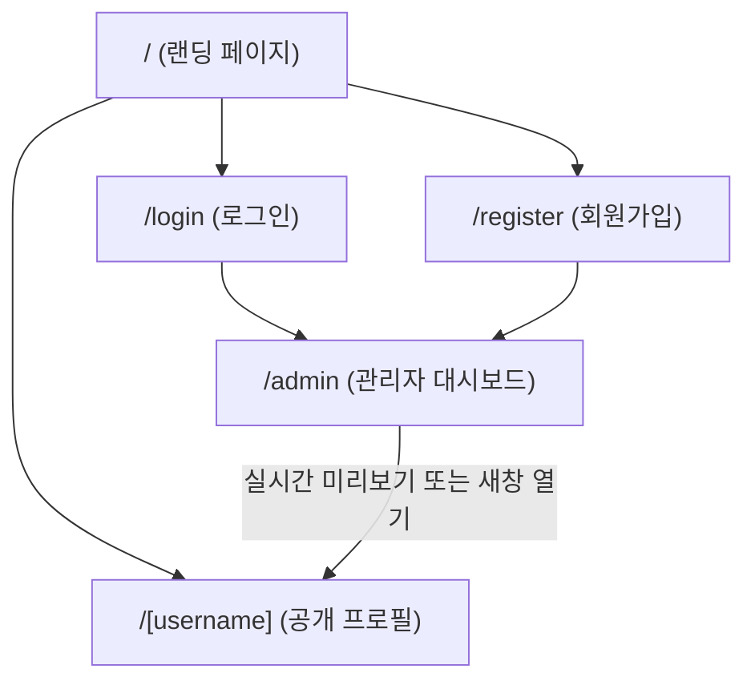

# [PRD] 링크트리 클론 서비스: mylink (기능 정의서)

> **버전:** v1.1.0 (MVP)  
> **작성일:** 2026-10-04  
> **상태:** 확정 (Aligned via `/grill-me` & `DESIGN.md` 준수 원칙 반영)  
> **문서 대상:** 기획자, 디자이너, 프론트엔드 개발자

---

## 1. 프로젝트 개요 (Overview)

### 1.1 서비스 정의
**'mylink'**는 크리에이터, 학생, 프리랜서, 개발자 등 모든 사용자가 흩어져 있는 자신의 온라인 링크(SNS, 포트폴리오, 프로젝트, 블로그 등)를 하나의 감각적인 단일 프로필 페이지로 모아 관리하고 공유할 수 있는 **링크인바이오(Link-in-bio) 웹 서비스**입니다.

### 1.2 개발 목적 및 배경
- 소셜 미디어(인스타그램, X, 틱톡 등)의 단일 프로필 링크 제약을 해소.
- 누구나 간편하게 자신만의 개성을 표현할 수 있도록 트렌디한 테마 프리셋과 실시간 모바일 미리보기를 제공.
- 백엔드/외부 인프라 복잡도를 최소화하기 위해 **Mock 데이터 및 LocalStorage 기반 클라이언트 전용 데모 아키텍처**로 구현하여, 별도 서버 설치 없이 브라우저에서 즉시 체험 및 테스트가 가능한 초소형 MVP를 구축.

### 1.3 ★ 디자인 핵심 원칙 (Non-Negotiable Design Rule)
> [!IMPORTANT]
> **메인 테마인 Discord 테마는 반드시 [`DESIGN.md`](./DESIGN.md)에 정의된 모든 디자인 토큰, 컬러 규격, 타이포그래피 위계, 컴포넌트 명세, Do's & Don'ts를 100% 엄격하게 준수해야 하며 임의로 변형하거나 벗어나서는 안 됩니다.**  
> (다른 보조 테마는 선택형 프리셋으로 다양성을 제공하되, 서비스의 정체성을 대표하는 플래그십 테마는 `DESIGN.md` 기반의 Discord 시스템입니다.)

---

## 2. 사용자 페르소나 및 핵심 유즈케이스 (Personas & Use Cases)

| 페르소나 | 주요 니즈 | 서비스 내 행동 |
| :--- | :--- | :--- |
| **대학생 / 주니어 개발자 (예: 안준성)** | 깃허브, 벨로그, 포트폴리오를 면접관이나 동료에게 감각적으로 전달 | 이메일 가입 후 `mylink/junseong` 생성, Discord 테마 적용, 링크 등록 후 공유 |
| **콘텐츠 크리에이터** | 유튜브, 인스타, 오픈채팅, 후원 링크를 팔로워에게 일괄 노출 | 뱃지(HOT, NEW)와 아이콘을 설정하고 실시간 미리보기로 확인 후 인스타 바이오에 등록 |
| **일반 방문자** | 크리에이터의 링크 모음 페이지에 접속해 원하는 콘텐츠로 이동 | 모바일 브라우저로 접속해 트렌디한 UI를 확인하고 링크 클릭 및 프로필 URL 복사 |

---

## 3. 서비스 범위 (Scope)

### In-Scope (MVP 핵심 기능)
- [x] 이메일/비밀번호 기반 자체 회원가입, 로그인, 로그아웃 (LocalStorage 기반 Mock Auth)
- [x] 고유 URL 핸들 선점 (`mylink/[username]`)
- [x] 링크 CRUD (생성, 조회, 수정, 삭제)
- [x] 링크 부가 속성 (제목, URL, 서브 설명, 뱃지/태그, 아이콘/이모지)
- [x] 링크 순서 변경 (드래그 앤 드롭 및 위/아래 이동) 및 활성화/숨김 토글
- [x] 프로필 정보 편집 (프로필 이미지, 닉네임, 한 줄 소개(Bio), 소셜 아이콘 바)
- [x] **DESIGN.md 규격 100% 준수 Discord 메인 테마** + 3종 보조 테마 프리셋 원클릭 적용
- [x] 데스크탑 2분할(좌측 편집기 + 우측 모바일 목업 실시간 프리뷰) 및 모바일 탭 전환 UI
- [x] 공개 프로필 페이지 (`/[username]`) 반응형 렌더링 및 링크 복사 토스트
- [x] 서비스 소개 랜딩 페이지 (`/`)

### Out-of-Scope (추후 로드맵으로 연기)
- [ ] 클릭수/방문자수 세부 통계 대시보드 (Analytics)
- [ ] 소셜 로그인 연동 (Google, Kakao OAuth)
- [ ] 미디어 실시간 재생 임베드 (유튜브 플레이어, 스포티파이 오디오 등)
- [ ] 유료 후원/결제 위젯 연동 (Stripe, 토스페이먼츠)
- [ ] 외부 클라우드 DB 연동 (PostgreSQL, Supabase 등)

---

## 4. 정보 구조 (IA) 및 라우팅 명세



| 경로 (Path) | 화면명 | 설명 및 주요 기능 |
| :--- | :--- | :--- |
| `/` | **서비스 랜딩 페이지** | Discord 테마 기반 히어로 및 마키 밴드, 서비스 소개, 샘플 데모 체험 링크, 로그인/가입 CTA |
| `/login` | **로그인 페이지** | 이메일/비밀번호 입력, 기본 테스트 계정 원클릭 로그인 지원 |
| `/register` | **회원가입 페이지** | 이메일, 비밀번호, 사용할 핸들(username) 입력 및 유효성 검사 |
| `/admin` | **관리자 대시보드** | 좌측 편집 패널(링크 관리 탭, 프로필/테마 탭) + 우측 실시간 모바일 목업 프리뷰 |
| `/[username]` | **공개 프로필 페이지** | 방문자 전용 페이지. 선택된 테마로 프로필 및 활성화된 링크 렌더링, URL 복사 기능 |

---

## 5. 세부 기능 요구사항 (Functional Requirements)

### 5.1 사용자 인증 및 계정 관리 (Auth & Account)
- **F-AUTH-01 (자체 가입):** 사용자는 이메일, 비밀번호, 고유 사용자명(`username`)을 입력하여 가입할 수 있다.
- **F-AUTH-02 (핸들 중복 검사):** `username`은 영문 소문자, 숫자, 하이픈(-), 언더바(_)만 허용하며 중복될 수 없다.
- **F-AUTH-03 (Mock Auth 영속성):** 계정 정보는 LocalStorage의 `mylink_users`에 저장되며, 로그인 세션은 `mylink_current_user`로 유지된다.
- **F-AUTH-04 (빠른 체험용 시드 계정):** 최초 접속 시 기본 테스트 계정(예: `junseong` / `demo@mylink.io` / `password123`)이 사전 생성되어 즉시 로그인 가능하도록 지원한다.
- **F-AUTH-05 (접근 제어):** 미로그인 상태에서 `/admin` 접근 시 `/login`으로 리다이렉트된다.

### 5.2 링크 관리 (Link Management)
- **F-LINK-01 (링크 추가):** '새 링크 추가' 버튼을 통해 즉시 상단에 새 링크 카드가 생성된다.
- **F-LINK-02 (필수 필드):** 
  - `title`: 링크 버튼에 표시될 텍스트 (최대 50자)
  - `url`: 이동할 목적지 링크 (http/https 자동 보정 또는 유효성 검사)
- **F-LINK-03 (선택 부가 필드):**
  - `description`: 링크 아래 작게 표시될 부연 설명 (최대 100자)
  - `badge`: 링크 우측에 강조 표시될 뱃지 텍스트 (예: HOT, NEW, PORTFOLIO, BLOG)
  - `icon`: 링크 좌측에 표시될 아이콘/이모지 (프리셋 아이콘 선택기 또는 이모지 입력)
- **F-LINK-04 (활성화 토글):** 각 링크 카드의 스위치를 통해 활성화/비활성화할 수 있으며, 비활성화된 링크는 공개 프로필 및 프리뷰에서 숨김 처리된다.
- **F-LINK-05 (순서 정렬):** 드래그 앤 드롭 핸들 또는 위/아래 이동 버튼을 통해 링크 순서를 자유롭게 변경할 수 있다.
- **F-LINK-06 (링크 삭제):** 삭제 확인 후 목록에서 제거할 수 있다.

### 5.3 프로필 및 소셜 아이콘 관리 (Profile & Socials)
- **F-PROF-01 (기본 정보 수정):**
  - 프로필 이미지: 기본 아바타 선택 또는 이미지 URL 입력 (또는 로컬 Base64 업로드 지원)
  - 닉네임 (Display Name): 화면에 크게 표시될 이름
  - Bio (한 줄 소개): 프로필 하단에 표시될 소개글 (최대 200자)
- **F-PROF-02 (소셜 아이콘 바):**
  - 인스타그램, 깃허브, X(트위터), 유튜브, 링크드인, 이메일 등의 URL 입력 지원
  - 입력된 소셜 채널만 프로필 카드 상단/하단에 아이콘 칩 형태로 노출

### 5.4 테마 및 디자인 커스터마이징 (Themes & Appearance)
- **F-THM-01 (테마 프리셋 제공):**
  1. **Discord Arcade (메인 기본 테마 - DESIGN.md 준수 필수):**
     - 딥 인디고 캔버스(`colors.canvas`: `#0a0d3a`) + 블러플-마젠타 동적 그라디언트 메쉬
     - 레이즈드 인디고 서피스(`colors.surface-indigo`: `#1e2353`) 및 블러플(`colors.primary`: `#5865f2`) 버튼
     - 최고 중요도 CTA 전용 일렉트릭 그린(`colors.green`: `#35ed7e`) 버튼
     - 볼드 디스플레이 폰트 및 라운드 기하학 (`rounded.sm` 12px, `rounded.lg` 16px, `rounded.xl` 40px, `rounded.pill` 50px)
  2. **Minimal Clean (미니멀 화이트):** 순백색 배경, 간결한 타이포그래피, 얇은 보더 라인, 깔끔한 모노톤
  3. **Cyberpunk Dark (다크 네온):** 칠흑색 배경, 형광 시안/마젠타 글로우 효과, 퓨처리스틱 디자인
  4. **Pastel Aesthetic (소프트 파스텔):** 따뜻한 크림/피치 톤 배경, 소프트 라운드, 부드러운 그림자
- **F-THM-02 (실시간 반영):** 테마 변경 시 관리자 화면의 우측 모바일 목업에 지연 없이 0.1초 내로 반영된다.

### 5.5 실시간 모바일 미리보기 (Real-time Preview)
- **F-PREV-01 (스마트폰 목업 프레임):** 아이폰 형태의 라운드 프레임과 노치/다이나믹 아일랜드 디테일을 갖춘 실시간 시뮬레이터 제공.
- **F-PREV-02 (양방향 인터랙션):** 프리뷰 내의 링크 클릭 테스트 가능 (새 창 열림 확인), 링크 복사 인터랙션 시뮬레이션 지원.
- **F-PREV-03 (반응형 대응):**
  - **데스크탑(>= 1024px):** 좌측 60% 에디터 패널, 우측 40% 고정 프리뷰 프레임
  - **태블릿/모바일(< 1024px):** 상단 또는 하단 플로팅 탭바를 통해 [편집 모드] / [미리보기 모드] 원터치 전환

### 5.6 공개 프로필 페이지 (`/[username]`)
- **F-PUB-01 (동적 라우팅):** URL 파라미터 `username`에 해당하는 사용자 데이터를 LocalStorage에서 조회하여 표시.
- **F-PUB-02 (존재하지 않는 사용자):** 등록되지 않은 사용자일 경우 "사용자를 찾을 수 없습니다" 404 안내 및 "나만의 mylink 만들기" CTA 제공.
- **F-PUB-03 (공유 및 링크 복사):** 하단 '프로필 링크 복사' 버튼 클릭 시 클립보드 복사 및 성공 토스트 팝업 표출 (Discord 테마의 경우 `button-green` 스타일 적용).
- **F-PUB-04 (브랜드 푸터):** "Powered by mylink" 브랜드 뱃지 노출 (클릭 시 랜딩 페이지 이동).

---

## 6. 데이터 구조 (Data Schema - LocalStorage Model)

```typescript
// 사용자 계정 모델
interface User {
  id: string;             // UUID
  email: string;          // 고유 이메일
  password: string;       // 평문/해시 (Mock)
  username: string;       // 고유 핸들 (URL 슬러그)
  createdAt: string;
}

// 사용자 프로필 모델
interface Profile {
  userId: string;
  displayName: string;    // 표시 이름 (예: 안준성)
  bio: string;            // 한 줄 소개
  avatarUrl?: string;     // 아바타 이미지 URL 또는 Base64
  themeId: "discord" | "minimal" | "cyberpunk" | "pastel";
  socials: {
    github?: string;
    instagram?: string;
    twitter?: string;
    youtube?: string;
    linkedin?: string;
    email?: string;
  };
}

// 개별 링크 모델
interface LinkItem {
  id: string;             // UUID
  userId: string;
  title: string;          // 제목
  url: string;            // 목적지 URL
  description?: string;   // 부가 설명
  badge?: string;         // 뱃지 (HOT, NEW 등)
  icon?: string;          // 아이콘 종류 또는 이모지
  isActive: boolean;      // 활성화 여부
  order: number;          // 정렬 순서 (0, 1, 2, ...)
  createdAt: string;
}
```

### LocalStorage Key 구조
- `mylink_users`: `User[]`
- `mylink_profiles`: `Record<string, Profile>` (key: userId)
- `mylink_links`: `Record<string, LinkItem[]>` (key: userId)
- `mylink_session`: `{ currentUserId: string } | null`

---

## 7. ★ DESIGN.md 상세 준수 명세 (Discord Flagship Theme)

> `DESIGN.md`에 명시된 토큰 및 가이드라인을 100% 매핑하여 적용합니다.

### 7.1 컬러 팔레트 (Color Tokens)
| 토큰 | Hex 코드 | 역할 및 사용처 |
| :--- | :--- | :--- |
| `colors.primary` | `#5865f2` (Blurple) | **브랜드 앵커 컬러.** 기본 CTA 버튼(`button-primary`), 마키 밴드, 스탯 카드, 브랜드 로고 |
| `colors.green` | `#35ed7e` (Electric Green) | **단 하나의 최우선 CTA 전용.** ("프로필 링크 복사 및 공유" 버튼), 항상 검정 텍스트(`#000000`)와 페어링 |
| `colors.magenta` | `#ec48bd` (Vibrant Magenta) | 뱃지 태그(`badge`), 그라디언트 패널의 포인트, 강조 칩 |
| `colors.link` | `#00b0f4` (Link Cyan) | 다크 서피스 위의 인라인 텍스트 링크 |
| `colors.canvas` | `#0a0d3a` (Indigo Canvas) | **기본 배경 캔버스.** 블러플-마젠타 동적 그라디언트 메쉬가 흐르는 딥 인디고 |
| `colors.surface-indigo` | `#1e2353` (Raised Indigo) | 링크 카드, 패널 서피스, 고스트 버튼(`button-ghost`) |
| `colors.surface-onyx` | `#23272a` (Onyx) | 제품 크롬 카드, 서브 디바이더 |
| `colors.surface-black` | `#000000` (Pure Black) | 풀 블랙 쇼케이스 밴드 |
| `colors.ink` | `#ffffff` (White) | 인디고 캔버스 위의 주요 텍스트 |
| `colors.ink-dark` | `#000000` (Black) | 그린 버튼 및 화이트 버튼 위의 텍스트 |
| `colors.hairline` | `#23272a` | 테두리 및 구분선 |

### 7.2 타이포그래피 (Typography Hierarchy)
- **Display Type:** ABC Ginto Nord (오픈소스 대체: Space Grotesk / Hanken Grotesk weight 700~800)
  - 헤드라인은 짧고 단정하며 **대문자(ALL-CAPS)** 위주로 볼드하게 선언
- **Body & UI Type:** ggsans (대체: Inter / Plus Jakarta Sans weight 400~500)
- **대비 원칙:** 디스플레이 폰트(800)와 본문 폰트(400~500) 간의 드라마틱한 가중치 점프를 유지

| 토큰 | 폰트 크기 | Weight | Line Height | 용도 |
| :--- | :--- | :--- | :--- | :--- |
| `display-xl` | 82px | 800 | 1.0 | 히어로 최상단 헤드라인 |
| `display-lg` | 62px | 800 | 1.05 | 마키 밴드 텍스트 |
| `display-md` | 56px | 700 | 1.05 | 섹션 타이틀, CTA 밴드 |
| `heading-sm` | 22px | 700 | 1.2 | 프로필 카드 닉네임, 스텝 라벨 |
| `link-lg` | 18px | 500 | 1.4 | 주요 링크 버튼 라벨 |
| `body` | 16px | 400 | 1.5 | 기본 본문, 소개글(Bio) |
| `link-sm` | 14px | 500 | 1.4 | 뱃지, 소형 링크, 부연 설명 |

### 7.3 기하학 및 라운드 스케일 (Rounded Geometry)
- `rounded.xs`: 6px (소형 칩)
- `rounded.sm`: **12px** (Primary CTA & Green CTA 버튼 기본 둥글기)
- `rounded.md`: 14px (리스트 로우)
- `rounded.lg`: **16px** (링크 카드, 화이트/고스트 버튼, 뱃지)
- `rounded.xl`: **40px** (그라디언트 피처 패널, CTA 밴드)
- `rounded.pill`: **50px** (필 캡, 상태 칩)
- `rounded.jumbo`: **120px** (시그니처 오버사이즈 쉐이프)
- `rounded.full`: **9999px** (원형 아바타, 원형 소셜 아이콘)

### 7.4 컴포넌트 명세 (Components Specification)
- **`button-primary`**: 배경 `#5865f2`, 텍스트 `#ffffff`, 둥글기 `12px`(`rounded.sm`), 패딩 `16px 24px`
- **`button-green`**: 배경 `#35ed7e`, 텍스트 `#000000`, 둥글기 `12px`(`rounded.sm`), 패딩 `14px 24px` (최고 중요도 CTA)
- **`button-ghost`**: 배경 `#1e2353`, 텍스트 `#ffffff`, 둥글기 `16px`(`rounded.lg`), 패딩 `16px`
- **`badge`**: 배경 `#ec48bd`, 텍스트 `#ffffff`, 둥글기 `16px`(`rounded.lg`), 패딩 `4px 12px`
- **`marquee-band`**: 배경 `#5865f2`, 텍스트 `#ffffff`, 대문자 스크롤링 티커 (`display-lg`)
- **`elevation`**: 플랫 그림자 대신 바이올렛 확산 글로우 (`0 3px 68px rgba(69,42,124,0.1)`) 사용

### 7.5 엄격 준수 사항 (Do's and Don'ts)
- **[DO]** 딥 인디고 캔버스(`#0a0d3a`)와 블러플-마젠타 동적 그라디언트 메쉬를 기본 배경으로 채택한다.
- **[DO]** `#35ed7e`(Electric Green)은 페이지 내 '가장 중요한 1개의 CTA(프로필 링크 복사 및 공유)'에만 제한적으로 사용한다.
- **[DO]** 12px~16px의 컨트롤 라운드와 40px+의 패널 라운드로 친근하고 토이 라이크(Toy-like)한 게임 감성을 전달한다.
- **[DON'T]** 캔버스를 평평한 무채색 그레이나 단색 순수 블랙으로 처리하지 않는다.
- **[DON'T]** `#35ed7e`를 일반 꾸밈용 액센트나 여러 버튼에 중복 사용하지 않는다.
- **[DON'T]** 블러플, 그린, 마젠타의 기본 3색 화음 외에 또 다른 튀는 네 번째 원색을 임의로 추가하지 않는다.

---

## 8. 보조 테마 명세 (Alternative Themes)

| 테마 ID | 배경 (Background) | 카드 스타일 (Card Style) | 포인트 컬러 (Accent) | 폰트 감성 |
| :--- | :--- | :--- | :--- | :--- |
| `minimal` | `#fafafa` 클린 화이트 | `bg-white border-neutral-200 rounded-xl hover:border-black` | `#111111` (Monochrome) | 미니멀 산세리프 |
| `cyberpunk`| `#0a0b10` 딥 다크 네온 | `bg-[#13151f] border-[#00f0ff]/30 rounded-lg shadow-cyan` | `#00f0ff` (Cyan), `#ff007f` (Pink) | 테크 사이버 퓨처 |
| `pastel` | `#fdfbf7` 크림 베이지 | `bg-white/80 border-[#f0e6d6] rounded-3xl shadow-sm` | `#f28482` (Coral), `#84a59d` (Sage) | 따뜻한 감성 라운드 |

---

## 9. 단계별 개발 마일스톤 (Milestones)

### Phase 1: 기반 아키텍처 및 Mock Data Layer 구축
- LocalStorage 저장소 헬퍼 (`storage.ts`) 구현 (초기 데모 시드 데이터 자동 주입)
- Mock Auth Context & Hook (`useAuth`) 구현 (가입, 로그인, 로그아웃, 세션 감지)

### Phase 2: 관리자 대시보드 (`/admin`) 개발
- 데스크탑 2분할 뷰 및 모바일 탭 전환 레이아웃 구축
- 링크 목록 CRUD 폼 및 순서 변경 UI
- 프로필 정보 및 소셜 링크 편집 패널
- DESIGN.md 토큰을 준수하는 테마 선택 프리셋 컴포넌트
- 실시간 모바일 목업 프리뷰 프레임 완성

### Phase 3: 공개 프로필 페이지 (`/[username]`) 및 랜딩 페이지 (`/`) 개발
- 동적 라우트 `/[username]` 구현 (DESIGN.md 규격 100% 매핑된 Discord 테마 렌더링)
- 링크 복사 클립보드 및 토스트 UI (`button-green` 스타일 적용)
- 서비스 소개 랜딩 페이지 (`/`) 구현 (헤더, 마키 티커, 데모 프로필 진입 버튼, CTA)

### Phase 4: 테스트 및 검증
- 신규 계정 가입 -> 링크 추가 -> 테마 변경 -> 공개 URL 접속 풀 플로우 E2E 동작 검증
- 모바일/태블릿 반응형 검증 및 DESIGN.md 토큰 일치도 정밀 검증
